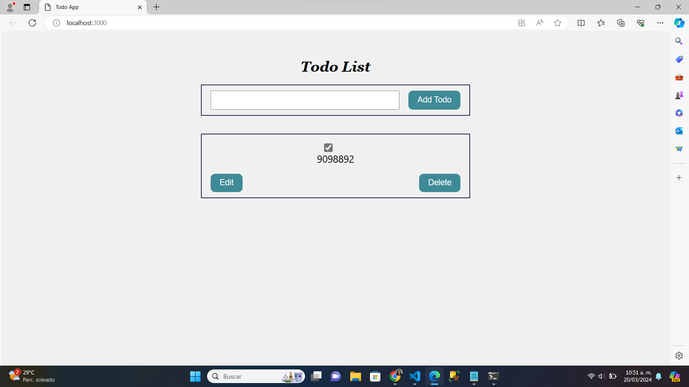

# Laboratorio práctico: aplicación React Todo_List


## Descripción: 
En esta práctica de laboratorio, utilizó React para crear una aplicación de lista de tareas pendientes que le permite ver la lista de tareas, agregar tareas, editar tareas y eliminar tareas.


## Objetivos

- Utiliza un manejador de eventos para crear la tarea "añadir tarea por hacer".

- Elimina la tarea completada de la lista de tareas por hacer utilizando el método de filtro.

- Agrega la función de alternancia y el cuadro de verificación para marcar la tarea como completada o no completada.

- Edita una tarea por hacer añadida y envíala utilizando la función de mapa.

- Utiliza el gancho UseEffect para guardar nuevas tareas por hacer en el almacenamiento local.

## Añadir una tarea

A continuación mostraremos el código que fue utilizado para la creación de una tarea

```sh
   
  function handleSubmit(e) {
    e.preventDefault();
    let todo = document.getElementById('todoAdd').value
    const newTodo = {
      id: new Date().getTime(),
      text: todo.trim(),
      completed: false,
    };
    if (newTodo.text.length > 0 ) {
        setTodos([...todos].concat(newTodo));
    } else {
        alert("Enter Valid Task");
    }
    document.getElementById('todoAdd').value = ""
  }
    return (
      <div id="todo-list">
        <h1>Todo List</h1>
          <form onSubmit={handleSubmit}>
            <input
              type="text"
              id = 'todoAdd'
            />
            <button type="submit">Add Todo</button>
        </form>
        {todos.map((todo) => <div className="todo" key={todo.id}>
            <div className="todo-text">{todo.text}</div>
        </div>)}
        </div>
  );

```

1.- La función handleSubmit se define para manejar el evento de envío del formulario. Cuando se activa este evento (al hacer clic en el botón "Add Todo"), se ejecuta esta función.

2.- e.preventDefault() evita el comportamiento predeterminado del evento de envío del formulario, que en este caso sería recargar la página.

3.- Se obtiene el valor del campo de entrada del formulario con el id 'todoAdd' y se guarda en la variable todo.

4.- Se crea un nuevo objeto newTodo que representa la tarea que se va a agregar a la lista. Se genera un ID único para la tarea basado en la marca de tiempo actual. El texto de la tarea se obtiene de todo, eliminando los espacios en blanco al principio y al final.

5.- Se verifica si el texto de la tarea (newTodo.text) tiene una longitud mayor que cero. Si es así, significa que la tarea es válida y se agrega al estado todos utilizando la función setTodos. Si el texto de la tarea está vacío, se muestra una alerta indicando que se debe ingresar una tarea válida.

6.- Se limpia el campo de entrada del formulario estableciendo su valor como una cadena vacía, para prepararlo para la próxima entrada de tarea.

7.- Finalmente, se devuelve un fragmento de JSX que representa la lista de tareas. Incluye un formulario con un campo de entrada para agregar nuevas tareas y un botón "Add Todo". Además, muestra cada tarea existente en la lista de tareas (todos) utilizando el método map() para iterar sobre el arreglo y renderizar cada tarea como un elemento <div> con la clase todo y el texto de la tarea dentro de un elemento <div> con la clase todo-text.

## Eliminar una tarea completada de la lista

A continuación mostraremos el código que fue utilizado para la eliminación de una tarea

``` r

    # Copiar el array 'todos' para evitar mutar el estado original
   function deleteTodo(id) {
    let updatedTodos = [...todos].filter((todo) => todo.id !== id);
    setTodos(updatedTodos);
    # Actualizar el estado 'todos' con las tareas filtradas
  } 

```
``` r

    <button onClick={() => deleteTodo(todo.id)}>Delete</button>

```
1.- La función deleteTodo elimina una tarea completada de la lista de tareas. Utiliza el método filter para crear un nuevo array sin la tarea específica que se desea eliminar, basándose en su id, y luego actualiza el estado de las tareas con este nuevo array.

2.- Agregue un botón para eliminar la tarea, que llamará al método deleteTodopasando la identificación del elemento de tarea pendiente al hacer clic. Se ha proporcionado un marcador de posición para agregar el botón.

## Agregar casilla de verificación y función de alternancia.

A continuación mostraremos el código que fue utilizado para añadir un CheckBox y la función toggle 

```r

  function toggleComplete(id) {
    let updatedTodos = [...todos].map((todo) => {
      if (todo.id === id) {
        todo.completed = !todo.completed;
      }
      return todo;
    });
    setTodos(updatedTodos);
  }

```

Este código define una función toggleComplete que se utiliza para cambiar el estado de completitud de una tarea específica en la lista de tareas. Aquí está cómo funciona:

1.- Recibe un parámetro id, que representa el ID único de la tarea que se desea marcar como completada o no completada.

2.-Crea una copia del arreglo todos utilizando el operador de propagación (...todos). Esto se hace para evitar la mutación directa del estado original.

3.-Utiliza el método map() para iterar sobre cada elemento del arreglo todos. Por cada tarea en el arreglo, se realiza lo siguiente:
    
    a. Comprueba si el id de la tarea actual coincide con el id pasado como parámetro. Si hay coincidencia, significa que esta es la tarea que queremos actualizar.

    b. Invierte el estado de completitud de la tarea actual. Si estaba marcada como completada, ahora se marca como no completada, y viceversa.

    c. Devuelve la tarea actualizada, ya sea modificada o no, de vuelta al arreglo.

4.- Después de terminar de mapear sobre todas las tareas, se actualiza el estado todos utilizando setTodos, pasando el arreglo actualizado de tareas updatedTodos.

Agregue el siguiente código para agregar el componente de casilla de verificación, junto a {todo.text}, dentro de la misma divetiqueta.
```r

  <input type="checkbox" id="completed" checked={todo.completed} onChange={() => toggleComplete(todo.id)}/>

```
## Editar una tarea para añadirla y enviarla.

A continuación mostraremos el código que fue utilizado para la modificación de una tarea y como guardarla al final.

Necesita otro estado para implementar la función de edición.

```r
const [todoEditing, setTodoEditing] = useState(null);
```
Ahora agregue la función enviarEditar en App.js que le ayudará a enviar la edición de tareas de la lista de tareas pendientes utilizando la función de mapa.
```r

function submitEdits(newtodo) {  
  #Generar una copia actualizada del arreglo de tareas utilizando el método map para recorrer cada tarea
  const updatedTodos = [...todos].map((todo) => {
    #Verificar si el ID de la tarea actual coincide con el ID de la nueva tarea editada
    if (todo.id === newtodo.id) {
      #Actualizar el texto de la tarea con el valor del campo de entrada correspondiente al ID de la tarea editada
      todo.text = document.getElementById(newtodo.id).value;
      #Devolver la tarea actual, ya sea modificada o sin cambios
    }
    return todo;
  });
  #Actualizar el estado de 'todos' con el nuevo arreglo de tareas actualizadas
  setTodos(updatedTodos);
  #Restablecer el estado de 'todoEditing' a null para indicar que no hay ninguna tarea actualmente en modo de edición
  setTodoEditing(null);
}


```

## Agregar el gancho useEffect.

A continuación mostraremos el código que fue utilizado para guardar en memoria local las tareas que demos como realizadas

Importe el useEffect del paquete de reacción. Reemplace la declaración de importación existente con el siguiente código.

```r
 import React, {useState,useEffect} from "react"; 
```
Ahora agregue el código que le permitirá almacenar las tareas en el almacenamiento local como JSON, justo debajo de la definición de estados.
```r
useEffect(() => {
  #Recuperar las tareas almacenadas en el localStorage
  const json = localStorage.getItem("todos");
  #Convertir las tareas almacenadas de formato JSON a un array de objetos
  const loadedTodos = JSON.parse(json);
  #Comprobar si hay tareas cargadas y establecerlas como el nuevo estado 'todos'
  if (loadedTodos) {
    setTodos(loadedTodos);
  }
}, []);#Este efecto se ejecuta solo una vez, al cargar el componente

useEffect(() => {
  #Verificar si hay tareas en el estado 'todos'
  if (todos.length > 0) {
    #Convertir las tareas a formato JSON
    const json = JSON.stringify(todos);
    #Guardar las tareas en el localStorage
    localStorage.setItem("todos", json);
  }
}, [todos]); #Este efecto se ejecuta cada vez que el estado 'todos' cambia
```

## Conclusiones Generales

La creacion de este proyecto consto de la creacion de un sitio web, tomado de el siguiente link de la plataforma llamada `Skills Netowrk`:

- [Skills Netowrk](https://acortar.link/2cbbrE)

 la implementación práctica de la creación de tareas, la eliminación y edición dinámica, junto con la interactividad mejorada mediante casillas de verificación y la alternancia, demuestran la robustez y la reactividad de una aplicación construida con React. La persistencia de datos utilizando el hook useEffect garantiza que las tareas se guarden y se mantengan entre sesiones del navegador, proporcionando una experiencia de usuario fluida y continua. Estas funcionalidades esenciales preparan a los desarrolladores para construir aplicaciones web completas y eficientes, donde la manipulación de estados y la interacción dinámica son fundamentales. En lo personal la creacion de esta practica fue sencilla, pero un poco tediosa, sencilla porque ya teniamos el manual y los fracmentos de codigos que ibamos ir utilizando y tediosa al momento de intentar comprender que hacia cada linea, pero se logro el objetivo final. Considero que Skills Netowork es una buena herramienta para nosotros que como estudiantes vamos iniciando. 
 
 Anexo una imagen de la pagina web final.
